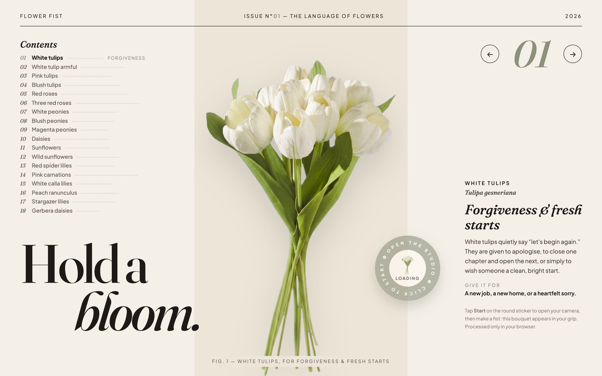
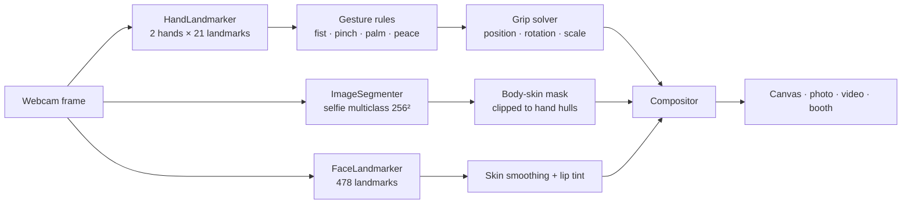
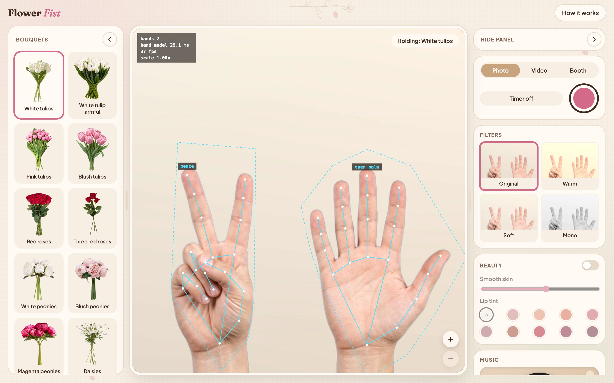
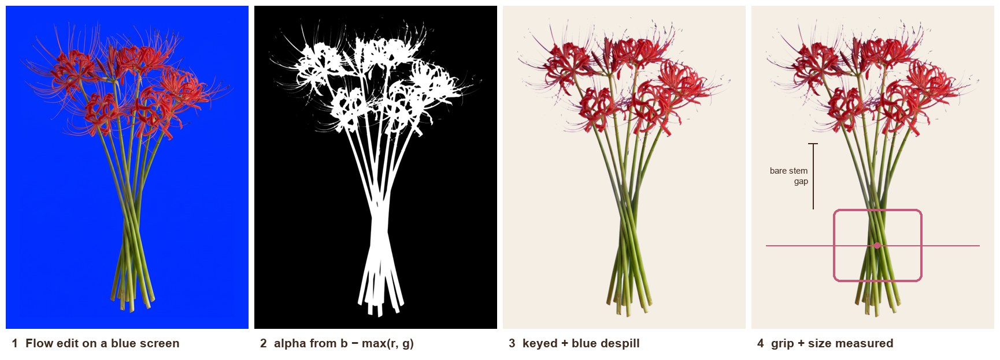
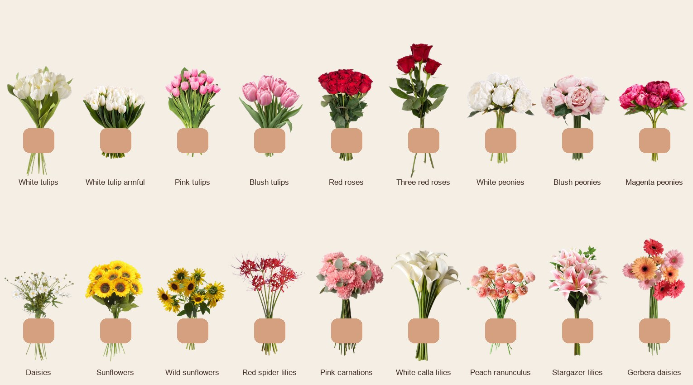
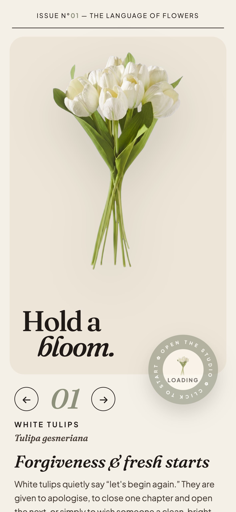
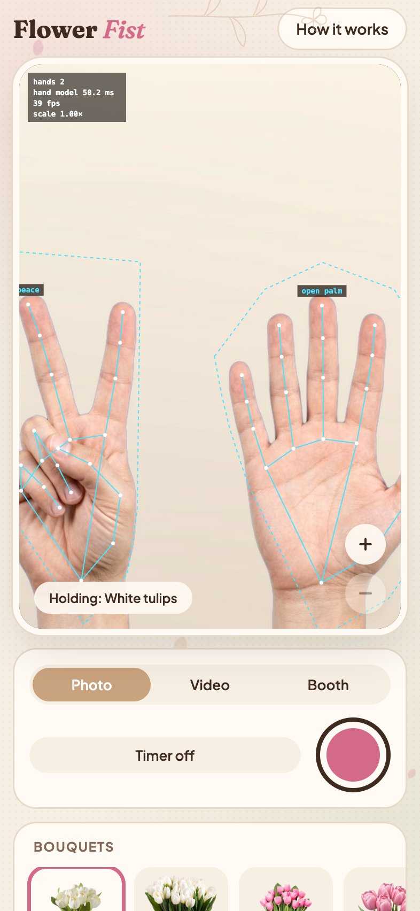

# 💐 Flower Fist

**Make a fist in front of your webcam and a real bouquet appears in your hand, held by its stems.**

Flower Fist is a real-time computer-vision studio that runs entirely in the browser. Three on-device models track your hands, face and skin every frame. The bouquet is anchored to your grip, turns with your wrist and sits *behind* your fingers. Nothing is uploaded: every frame is processed on your own device.

**Try it:** https://flower-fist.vercel.app &nbsp;·&nbsp; **See what the models see:** https://flower-fist.vercel.app/?debug



## How it works

Every animation frame runs this pipeline on the GPU through MediaPipe Tasks Vision (WebAssembly + WebGL):



| Model | Output used | Runs |
| --- | --- | --- |
| `hand_landmarker` (float16) | 21 image landmarks + 21 world landmarks (metres) per hand, up to 2 hands | every frame |
| `selfie_multiclass_256x256` | confidence masks for *body skin* (class 2) and *face skin* (class 3) | only while a bouquet is held or beauty is on |
| `face_landmarker` (float16) | 478-point face mesh | only while beauty is on |



*The `?debug` view: the 21-point skeleton of each hand, the convex hull that limits the skin mask, the gesture each hand is making, the grip point and stem axis, and per-frame timing. The hand model takes about 25–50 ms a frame on the MacBook it was built on.*

### 1. From landmarks to gestures

No gesture classifier is trained; each pose is a small geometric rule on the **world landmarks**. They are in metres and centred on the hand, so the rules hold whatever the hand's distance from the camera or angle to it.

A finger is *curled* when its tip is closer to the wrist than its middle joint:

```
curled(tip, pip) = ‖tip − wrist‖ < ‖pip − wrist‖
```

| Gesture | Rule | Used for |
| --- | --- | --- |
| **Fist** | index, middle, ring and pinky all curled, for 3 frames in a row | hold the bouquet |
| **Pinch / spread** | middle, ring, pinky curled; thumb–index gap ÷ palm length | resize, 1×–2.5× |
| **Open palm** | no finger curled, held 0.5 s | lock the size |
| **Peace** | index + middle straight, ring + pinky curled, held 0.5 s | unlock the size |

The pinch gap is `min(‖thumb tip − index tip‖, ‖thumb tip − index DIP‖) / ‖wrist − middle knuckle‖`. Dividing by palm length makes it independent of hand size and depth. Measuring to the DIP as well covers the moment the index tip disappears behind the thumb.

When both hands make a fist (a tight pinch curls the index finger too), the holder is the hand nearest the bouquet. If there is no bouquet yet, it is the hand whose thumb is *not* pinching.

### 2. Holding the bouquet

A closed fist is a tube, and the stems run through its hollow, so:

- **Position**: the centroid of all 16 finger joints (landmarks 5–20), nudged sideways by 10% of the knuckle span into the hollow
- **Rotation**: the axis from the pinky knuckle (17) to the index knuckle (5)
- **Scale**: the knuckle span ‖5 − 17‖ times the bouquet's own `size`

Position, rotation and scale are smoothed with separate exponential filters (0.4 / 0.3 / 0.2), so the bouquet follows quickly without jitter. It pops in with an ease-out-back curve.

### 3. Fingers in front of the stems

The bouquet is drawn first and the hand is drawn back over it. The *body skin* confidence mask from the segmenter is:

1. remapped through a smoothstep between 0.3 and 0.7 for a soft but tight edge,
2. clipped to each hand's landmark convex hull, grown by 35%, so arms and neck never cover the flowers,
3. used as an alpha mask over the live frame, then composited on top of the bouquet.

### 4. Beauty

- **Smooth skin**: a blurred copy of the face, masked by the *face skin* class, with the eyes, brows and lips cut out (convex hulls of their mesh points). It is blended with `lighten`, so it only lifts blemishes and pore shadows and keeps real skin texture.
- **Lip tint**: an even-odd fill between the outer and inner lip contours, with a radial gradient, blended with `multiply` + `color` so lip texture and shading show through.

## The bouquets



Eighteen bouquets come from real photographs. Each one is cleaned in Google Flow (wrapping, ribbons, vases and hands removed) and placed on a blue screen. A local Python pipeline in [`tools/asset-pipeline`](tools/asset-pipeline) then does the rest:

- **`chroma_key.py`**: alpha from `b − max(r, g)` on a soft ramp, blue despill, tight crop. It checks that no visible blue pixels are left.
- **`measure_bouquet.py`**: places the grip a fixed number of knuckle spans below the lowest bloom, so bare stem always shows between flowers and fingers. It matches the flower head to a reference bouquet by area and width, so every bouquet feels equally big in the hand.
- **`stretch_stems.py`**: lengthens only the bare-stem rows when an edit made the stems too short.



*All 18 bouquets at hand scale, each aligned on its grip point.*

## The studio

- **Capture**: photo, video (canvas + Web Audio mixed into one MediaRecorder stream) and a **photo booth** that composes 1–4 shots into strips or grids at real print sizes (2×6, 4R, square, story) with floral frames
- **Filters** with live previews of your own camera
- **Music**: a turntable playing 30-second Spotify previews, optionally recorded into your video
- **Flower meanings**: every bouquet has its meaning in the language of flowers, shown as a magazine "issue" on the landing page
- **Five-step tutorial**: each step's ring fills only while the camera actually sees the pose
- **Responsive**: desktop, iPad and phone layouts

| Phone | Phone, `?debug` |
| --- | --- |
|  |  |

## Run locally

No build step and no dependencies. Serve the folder over `localhost` (camera access needs `localhost` or HTTPS):

```bash
git clone https://github.com/GianneAngely/flower-fist.git
cd flower-fist
python3 -m http.server 8000
open http://localhost:8000
```

Add `?debug` to the URL to draw the landmarks, gestures, grip and timing over the camera.

To rebuild a bouquet asset:

```bash
cd tools/asset-pipeline
pip install -r requirements.txt
python chroma_key.py path/to/blue-screen-jpgs ../../assets/flowers spider-lily
python measure_bouquet.py ../../assets/flowers spider-lily 0.42
```

## What's inside

- **index.html**: landing magazine, studio and photo booth markup
- **app.js**: camera, models, gesture rules, grip solver, compositor, beauty, capture, music
- **booth.js**: photo-booth print renderer (layouts, print sizes, frames)
- **flowers.js**: the 18 bouquets: grip point, size, meaning, palette
- **playlist.js**: the music card's tracks
- **style.css**: all styling, including the responsive layouts
- **assets/**: keyed bouquet PNGs and tutorial hand poses
- **tools/asset-pipeline/**: the Python scripts that make the bouquet assets
- **docs/**: the images in this README

## Built with

MediaPipe Tasks Vision (HandLandmarker, ImageSegmenter, FaceLandmarker) · Canvas 2D · MediaRecorder · Web Audio · Python (NumPy, Pillow) · Google Flow · Vercel

Plain HTML, CSS and JavaScript modules: no framework, no bundler.

## Credits

Bouquet photo sources and the playlist are listed in [CREDITS.md](CREDITS.md).
